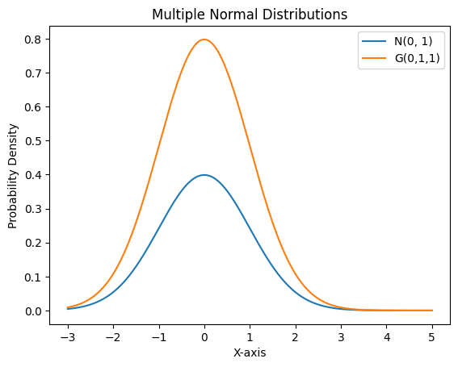

<!--
 * @Author: loyunemo
 * @Date: 2023-11-01 16:34:33
 * @LastEditors: loyunemo
 * @LastEditTime: 2023-11-04 19:42:39
 * @FilePath: \Repo_Computer_Simulation\Hw5\Notes-Chapter6.md
-->
#### 马尔可夫链
转移仅仅依赖于当前状态，而与以前的状态无关而产生的试验序$\{X_t\}$列称之为马尔可夫链。
**性质：**
1、遗忘性。前面怎么样我不知道，我只要考虑目前的状态转移就好。

**表示方式**
全空间表示为$\Omega$,$\Omega=\{x_1,x_2,x_3,\dots,x_n\}$
通过连接节点的有向边来表示从$x_i$到$x_j$的转移,在转移有向边上标注转移概率$p_ij$。
对于此状态到下状态的定义转移矩阵P：
$$\begin{pmatrix}
    p_{11}& p_{12}&\dots &p_{1n}\\
    p_{21}& p_{22}&\dots &p_{2n}\\
    \vdots&\vdots&\dots&\vdots\\
    p_{31}& p_{32}&\dots &p_{1n}\\
\end{pmatrix}$$
**不变分布**
对于马尔可夫链的迭代关系式有，$$\bold{p}_{t+1}=\bold{p}_t P$$,
对时间取极限可以得到$$\pi P=\pi$$
$\pi$即为所需要求的转移概率矩阵。
**Perron-Frobenius定理**
若概率转移矩阵P具有
$$p_{ij}>\delta>0,\forall i,j$$
 P存在特征值为1且对应左特征向量严格为正，并且唯一
 此特征向量进一步被归一化，有：
 $$lim_{n {->}\infty}P^n =\bold{1w}$$
对于任意概率的行向量有:
 $$lim_{n {->}\infty}\alpha P^n =\bold{w}$$
其中w归一左特征向量w为行向量。、
#### MCMC抽样——Metropolis 算法
**马尔可夫链蒙特卡罗抽样方法**
构造一个可以遍历的马尔可夫链，让其不变分布成为人们所需要的抽样分布。
**接受-拒绝抽样方法**
选取容易抽样的概率分布函数g(x)（称作建议分布）保证目标概率分布函数$f(x)<=Mg(x)$在定义域上始终成立。M为正常数。
生成服从概率密度函数为g(x)的建议随机数y。
再生成一个服从均匀分布U(0,1)的随机数，即代表这个部分是在哪一部分内存在的。根据概率分布可以知道这个概率指代的位置大概在哪。
如下图：

计算接受准则的概率函数$h(x)=\frac{f(x)}{Mg(x)}$
如果生成的随机数比h(y)小，就是产生这个的条件概率内，就接受，使其符合抽样。否则就反对。
可以说马尔可夫链蒙特卡罗方法是这个方法的推广。
**Metropolis 算法**
从建议概率密度函数$g(\cdot|x_t)$产生随机数y作为建议的下一个状态
然后根据均匀分布生成一个随机数r，若$r<h(x,y)$则接受该建议的随机数，即$x_{t+1}=y$，否则$x_{t+1}=x_t$重复此过程产生随机序列。
**Metropolis-Hastings 算法**
1、满足对称性条件：
$$g(x|y)=g(y|x)$$
2、接受概率定义：
$$h(x,y)=\min\{1,\frac{f(y)g(x|y)}{f(x)g(y|x)}\}$$
对称性条件满足时：
可以简化为：$$h(x,y)=\min\{1,\frac{f(y)}{f(x)}\}$$
MCMC抽样和便利性定理
若$\{x_1,x_2,x_3,\dots,x_N\}$为一个在有限状态空间$\Omega$上的不可约并且非周期的马尔可夫链，其平稳分布为$\pi$,设$\epsilon:\Omega->\bold{R}$为任意映射，则有$lim_{N->\infty}\frac{1}{N}\Sigma_{i=1}^N\epsilon(x_i)=\bold{E}_\pi(\epsilon)$
等式右边指的是相对于分布$\pi$的期望。