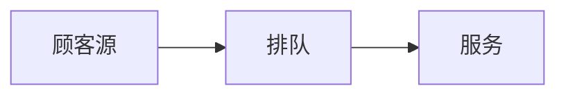

### 声明
本篇内容与老师上课内容无关，只是PPT和书的集合理解。
#### 随机服务系统
顾客排队购物模型

随机服务系统：
    1.输入过程
    2.排队规则
    3.服务机构
过程通常被假设为泊松过程。
排队规则根据顾客进入服务系统的方式，可以分为：**损失制、等待制、混合制**三大类。
损失制：输入在系统满负荷的时候放弃输入，离开系统。
等待制：加入队列。可以分为：先到先服务（FCFS）、后到先服务（LCFS）、随机服务、优先权服务等等。其实就是对输入怎么处理的问题。

在随机服务系统中，顾客的到达过程常常被假设为一个泊松过程。设$N(t)$表示在时间区间$[0,t)$内到达的顾客数，以$𝑃_n(t_1,t_2)$表示在时间区间$[𝑡_1,𝑡_2)$内有n个顾客到达的概率。所谓的泊松过程是指$𝑃_𝑛(𝑡_1,𝑡_2)$满足如下的泊松分布：$𝑃_𝑛(𝑡_1,𝑡_2=𝑃(𝑁𝑡2−𝑁𝑡1)=𝑛=𝜆𝑡2−𝑡1𝑛𝑛!𝑒−𝜆𝑡2−𝑡1,𝑛=0,1,2,...,(1)$并且对足够小的Δ𝑡,显然有𝑃1𝑡,𝑡+Δ𝑡=𝜆Δ𝑡+𝑜(Δ𝑡)(2)其中𝜆>0是常数，它表示单位时间顾客的平均到达数。上式表明，在[𝑡,𝑡+Δ𝑡)内有一个顾客到达的概率与t无关，而与Δ𝑡成正比。
